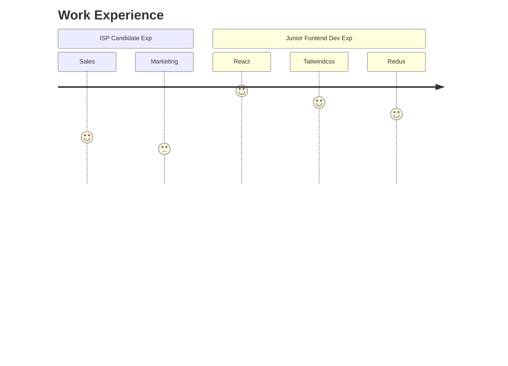

  <kbd>
    Open for Hire
    
  </kbd> 

 

<h1 align="center">Hi 👋, I'm Bijoy Kar</h1>
<h3 align="center">Full Stack Web Developer</h3>
<h4 align="center">

Kolkata, India
</h4>

 
Introduction: Full Stack Web Developer specializing in React and Next.js, with a strong interest in AI and Low-Level Programming in C++. Experienced in DSA with C++ and always eager to tackle new challenges. Open for hire—let’s build something great! 🚀

 

  

###

###

  
  
  
  
  
  
  
  
  
  
  
  
  
  
  

###

  
  
  
  <a href="https://x.com/iamBijoyKar" target="_blank">
  
  
  

###

 

###

###

 
  <h3>TechStarHub Oranization </h3>

Managing **_[TechStarHub](https://github.com/TechStarHub)_** Github Oranization. Here we help out beginner developers with open source, by providing them beginner friendly but real world projects. Also we build awesome projects with real-world application. We welcome new members warmly. Please feel free to join 🥳.

###

 

<h2 align="center">
  Some of the Highlights of my Projects 👑
</h2>

  View the Highlighted Projects

| Project | Description                                                                                                                                    | Link                                                | Status          |
| ------- | ---------------------------------------------------------------------------------------------------------------------------------------------- | --------------------------------------------------- | --------------- |
| Srot    | Srot is a flow editor that allows you to create flow diagrams with ease.                                                                       | [**_Link_**](https://srot-flow.vercel.app/)         | _On Devlopment_ |
| JsonDB  | JsonDB is a simple Json Database made with C++. You can create and make queries to the database using the CLI application.                     | [**_Link_**](https://github.com/iamBijoyKar/jsondb) | _On Devlopment_ |
| Jamun   | A simple and lightweight Static Site Generator with features like markdown support, directory structure routing, and more.                     | [**_Link_**](https://github.com/iamBijoyKar/jamun)  | _On Devlopment_ |
| X-Code  | A very simple and lightweight code editor built with Tauri and React. It has a very simple and clean user interface and is very easy to use.   | [**_Link_**](https://github.com/iamBijoyKar/x-code) | _On Devlopment_ |
| Luna    | Luna is an ollama wrapper with extra features. Written in JavaScript.                                                                          | [**_Link_**](https://github.com/iamBijoyKar/luna)   | _On Devlopment_ |
| Amber   | Amber is a custom made Neural Network library written in Python. I am build this libray to learn more about Neural Networks and how they work. | [**_Link_**](https://github.com/iamBijoyKar/amber)  | _On Devlopment_ |

 

<h2 align="center">
  Work Experiences 👷‍♂️
</h2>

